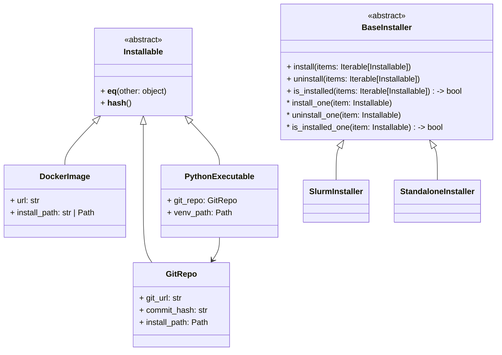

# Development
This document targets developers who want to contribute to the project's core.

## Project Structure and imports
We use [import-linter](https://github.com/seddonym/import-linter) to ensure no core modules import higher level modules.

1. `_core/` should depends only on itself and provide all base classes. For example, `System` class should be imported from top-level `cloudai` package, but `SlurmSystem` should be imported from `cloudai.systems.slurm`.
1. Top-level `cloudai/__init__.py` should not re-export any packages.
1. Workloads are organized under `cloudai.workloads`, each workload has its own package. `TestDefinition`, `CmdArgs`, command generation strategies, etc. are defined in the workload's package. Each workload is responsible for registering itself and related strategies.
1. Systems are organized under `cloudai.systems`, each system has its own package. It includes `System` derivative, installer and runner classes. Systems should not depend on workloads.

## Core Modules

`Registry` object is a singleton that holds implementation mappings. Users can register their own implementations to the registry or replace the default implementations.

## Runners
TBD

## Installers
TBD

## Systems
TBD

## Cache
Some prerequisites can be installed: docker images, git repos with executable scripts, etc. All such "installables" are kept under System's `install_path`.

Installables are shared among all tests. So if any number of tests use the same installable, it is installed only once for a particular System TOML.

