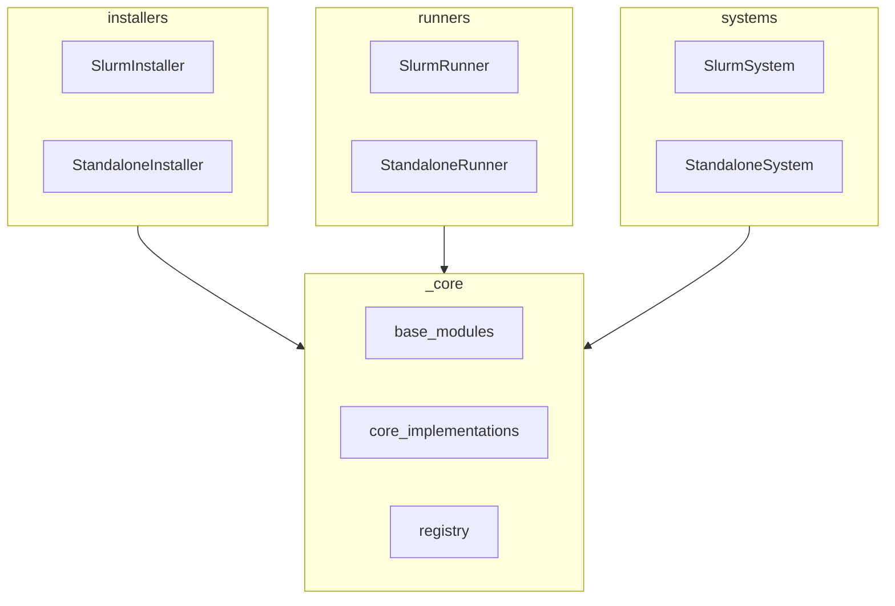
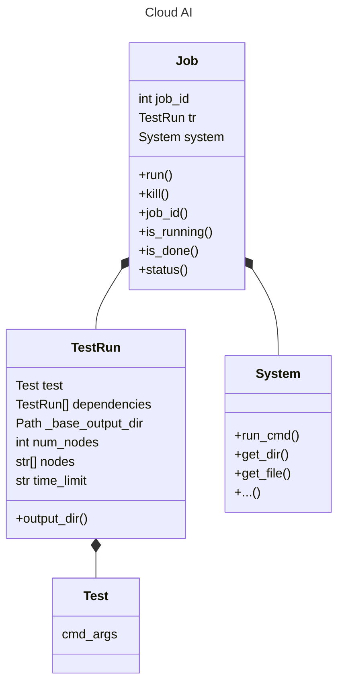
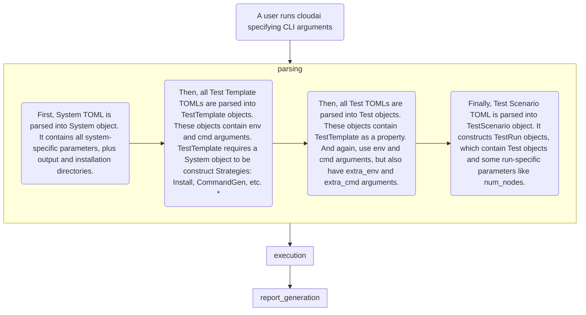

# Development
This document targets developers who want to contribute to the project's core.

## Core Modules
We use [import-linter](https://github.com/seddonym/import-linter) to ensure no core modules import higher level modules.

`Registry` object is a singleton that holds implementation mappings. Users can register their own implementations to the registry or replace the default implementations.

## Runners
TBD

## Installers
TBD

## Systems
TBD

1. `Test` is a `TestDefinition` from Pydantic intro PR. It is a test with all arguments. Basically, it is a reflection of a Test.toml, where all params are defined or default values are used.
1. `TestRun` is a `Test` instance with `System`-specific parameters, like `num_nodes` for Slurm system.
1. `Job` is a single runnable unit. `Job` knows how to interact with the system to get required information like job status. It can consist of a single `TestRun` or multiple `TestRun`s. For Slurm system this means that a single sbatch script can contain one or multiple tests.

Notes:
1. `BaseRunner` and derivatives to be merged into Job class.

# Execution flow through the system

\* Some Strategies are inherited from TestTemplateStrategy and require System, env, and cmd arguments for their construction. Other Strategies fo not require any arguments.

## output directory
Output directory is set per Cloud AI invocation. It is constructed as follows:
1. `BaseOutputDir = System.output_directory + TestScenario.name + CurrentTime`
1. Each test then adds its own subdirectory to the output directory like `BaseOutputDir/TestName`

