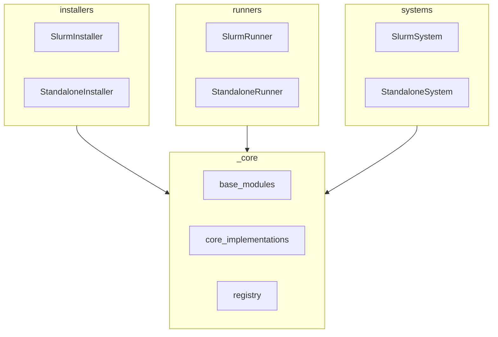

# Overview
This document targets developers who want to contribute to the project's core.

## Core Modules
We use [import-linter](https://github.com/seddonym/import-linter) to ensure no core modules import higher level modules.

`Registry` object is a singleton that holds implementation mappings. Users can register their own implementations to the registry or replace the default implementations.

## Runners
TBD

## Installers
TBD

## Systems
TBD
